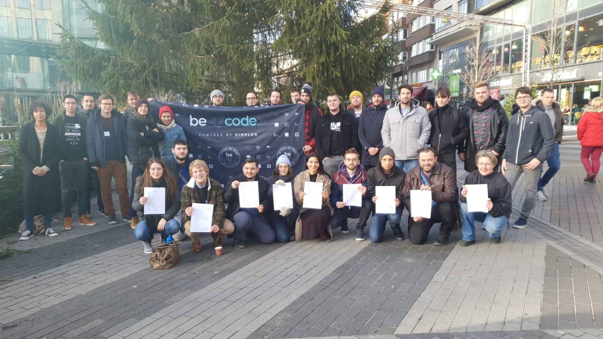

# CRL-Keller-1-18

Ce repo est pour tout ce qui concerne ton activité à BeCode : briefings, parcours, etc.
Clone-le sur ton ordi et `git pull` régulièrement afin de rapatrier les mises à jour.

## Tes sources d'information pour respecter les règles de BeCode

1. Lis le [contrat pédagogique](../../../BeCode/blob/master/contratpedagogique.md).
2. Le [Wiki de BeCode](https://github.com/becodeorg/BeCode/wiki)

## Retards et absences

En cas de retard, d'absence ou de départ anticipé (que ça soit prévu ou pas du tout), préviens-nous en passant par la plateforme my.becode.org. [[Mode d'emploi](https://github.com/becodeorg/BeCode/blob/master/mybecode-absence-fr.md)]

Dans l'ordre:

- Tu envoies un email à tes coachs, rédigé professionnellement (à charleroi@becode.org).
- Tu préviens via la plateforme [my.becode.org](https://my.becode.org).
- Document justificatif, envoie-le directement, si possible, sinon envoie-le dès que tu l'as reçu.
- Pas de justificatif ? Dis-le nous explicitement.

[Petit rappel](https://github.com/becodeorg/BeCode/blob/master/contratpedagogique.md#sanctions) :

- 2 retards non justifiés seront comptabilisés comme une absence.
- 2 absences entraîneront une convocation en entretien individuel.
- 6 absences non justifiées entraîneront une exclusion définitive.
- Si le taux d'absence (justifiée ou non) du junior dépasse 20%, BeCode pourra unilatéralement décider de mettre fin à son contrat.

## Planning

- 10/12 : Début de la prairie : [La prairie](Parcours/01-Prairie)
- 13/02 : Fin de la prairie, début de la colline : [La colline](/Parcours/02-Colline)

### Vacances

- du 24/02/2020 au 28/02/2020
- du 06/04/2020 au 10/04/2020

## Contenus pédagogiques

- [Parcours](/Parcours) : les parcours sont des tutoriels à faire en solitaire, alliant théorie et pratique, afin de monter rapidement en compétence. Ils sont rédigés par tes coachs. N'hésite pas à les refaire plusieurs fois.  
- [Projects](/Projects) : les projets sont conçus pour t'amener à découvrir par toi-même des problématiques spécifiques de code, en auto-apprentissage. Ils servent également, bien sûr, à t'entraîner sur des projets réalistes.
- Inscriptions à [La Veille](https://github.com/becodeorg/The-Watch/tree/master/CRL-Keller-1.18)

## Documents

- [La Veille](/Documents/1.TheWatch/TheWatch.pdf): Quelques conseils pour une veille efficace

## Contact coachs

- Pierre (pierre.noel@becode.org)
- Ludo (ludovic@becode.org)
- David (david@becode.org)

- Référent insertion professionnelle (eric@becode.org)

Fais egalement un petit tour sur [BeCode.org](https://www.becode.org/partners/index.html) pour connaître les différents membres de l'équipe BeCode.
